单周期处理器设计
=====================

程序的执行是个状态机
---------------------

状态机包含2部分内容，即 状态 和 状态转移的规则

而程序的执行，便可以看作一个状态机，其中

- 状态 -> PC(当前指令的位置) + 32个寄存器
- 状态转移的规则 -> 当前指令的行为

这样的说法可能暂时有些难以理解，下面举一个例子

.. code-block:: asm

    addi.w $r1, $r0, 5  // r1 <- 0 + 5
    addi.w $r2, $r0, 3  // r2 <- 0 + 3
    add.w $r3, $r1, $r2 // r3 <- r1 + r2
    b 0x00              // pc <- 0 (跳转到开头)

那么，它的状态机示意图如下

由此可见，程序的执行可以视作一个状态机

CPU是个状态机
---------------------

通过上面的过程，我们可以知道，程序的执行可以被视作状态机，那么作为程序执行的工具，CPU呢？

虽然CPU如何设计是微结构层次的话题

但无论怎么设计，总归是一个数字逻辑电路，而数字逻辑当中的状态机构造如下

根据第一部分

- 状态 -> PC(当前指令的位置) + 32个寄存器
- 状态转移的规则 -> 当前指令的行为

的对应关系，我们只需要将上图略微修改，便可以得到CPU的数字逻辑设计图

更切实际的处理器结构要稍复杂一些，如下图所示

代码实现
---------------------

上面的叙述仅仅是理论方面，那么怎么将上面的计算机模型转变成 Verilog 代码呢

我们可以先参考状态机的设计代码，总的来说，状态机的 Verilog 代码通常如下

.. code-block:: verilog

    module FSM(
        // 一堆输入输出
    );
    // reg和wire类型的变量声明

    always@(posedge clk) begin
        // reg类型的写入逻辑
        // 对应 状态机的状态更新
    end

    // 一系列的 assign 语句
    // 对应 组合逻辑部分(生成状态机下一状态)

    endmodule

下面再去参照着实验1的 miniCPU 的设计代码，是否相较之前更加能够理解单周期CPU的结构？也更加理解CPU和程序执行本质是状态机的含义？
   