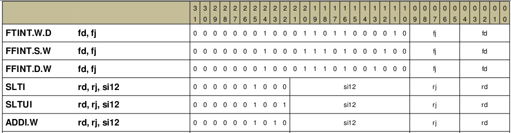

LA32R指令集系统
=====================

指令集系统的地位
---------------------

我们实验当中选择的指令集系统为 LoongArch32R 指令集，这是由 LoongArch32 指令集系统精简而来的一套指令集

指令集系统的主要作用，可以看作计算机软件和计算机硬件之间的一个交互接口

如果一个软件使用了某个指令集系统的规定进行了编写，同时硬件也实现了相应的规范，那么这个软件便可以运行在这个硬件之上

.. note::
   
   指令集体系规定的内容非常多，而我们只会用到其中很小的一部分

   这也就意味着我们处理器无法运行很多程序(例如类Unix操作系统)，但使用汇编编写一些定制程序是没有问题的！

阅读指令集手册
---------------------

想要设计一款使用 LoongArch32R 指令集系统的处理器，显然需要了解 LoongArch32R 指令集系统，而了解它的最好办法就是翻阅手册

下面以 `addi.w` 指令为例，分享一下翻阅手册需要着重注意的地方

使用搜索功能，可以很方便的在指令结构的速查表当中找到该指令

从上图我们可以看到，指令当中包含了4部分信息

- 操作码: LoongArch32R 的操作码不是定长的，高位就是操作码
- 立即数: 包含一个12bits长的立即数
- rj地址: 寄存器操作数地址
- rd地址: 寄存器写入地址

同时，我们可以在手册的前面找到该指令的具体行为

从该行为当中我们可以看到，这条指令会将 rj 寄存器的数值 加上 符号拓展后的立即数 最后储存到 rd 寄存器当中

从手册当中获得的这些信息，描述了 `addi.w` 这条指令的具体行为，结合CPU是一个状态机的论断，可以从上面的具体行为当中得到这条指令的组合逻辑部分应该如何设计

.. note::
   可以到miniCPU的代码当中，是如何将上面这条指令转化为实际的 Verilog 状态机代码的

   同时，分析剩余的4条指令，又是如何工作的，了解了这些，完成实验1应当不成问题

