外部设备
=====================

如果我们的处理器只能执行单纯的计算，那就太没有意思了，而且这样我们也没有办法观察处理器的运行结果

总的来说，我们需要处理器能够控制其他设备，例如点亮一个LED灯

处理器只能够从内存读取数据，进行计算，然后再写入到内存当中，那么如何实现处理器同设备交互呢？容易想到，我们可以将设备映射到内存当中

这样，通过访问内存，我们便可以控制设备了，假设LED灯的地址位于 0x00001000 那么我们可以写下

.. code-block:: asm

    addi.w $r1, $r0, 1      // 将1赋值给r1
    st.w $r1, $r0, 0x01000  // 将r1，也就是1写入LED灯地址

通过上面的代码，我们就可以控制LED灯的点亮了，同理，赋值为0便可以熄灭

如果上面的地址不是LED灯的地址，而是显存地址，那么我们就可以控制显示器显示图形

.. note::
   
   实验1当中的设备控制还十分简单，当进行实验2和实验3时，我们会接触更加现实的设备控制器，到时候再讲述处理器控制外部设备的完整流程
