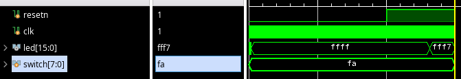

完成实验1
=====================

开发CPU代码
---------------------

第一个5条指令单周期CPU的实验采用的是提供一套现成的Verilog代码让读者填空的方式。这套待填空的代码已经位于 minicpu_env/miniCPU/ 目录下

创建Vivado工程
---------------------

将Vivado工程建在 minicpu_env/soc_verify/run_vivado/ 目录下。如果该目录下尚未创建工程，请利用minicpu_env/soc_verify/run_vivado/ 目录下的 create_project.tcl 文件创建工程。

.. hint:: 
    
    利用create_project.tcl创建工程可参考 `利用tcl创建Vivado工程 <https://bookdown.org/loongson/_book3/appendix-vivado-advanced-usage.html#sec-vivado-tcl-create-project>`_

    如果使用的Vivado版本并非 2019.2 版本可参考 `升级工程和IP核 <https://bookdown.org/loongson/_book3/appendix-vivado-advanced-usage.html#sec-upgrade-project-ip>`_

仿真验证自己的CPU
---------------------

创建工程后运行仿真，CPU会运行一个斐波那契数列程序，通过拨码开关输入数字，LED灯输出该位置的斐波那契数

.. hint:: 
    
    如果仿真后，发现CPU没有正确执行程序，可以结合 func/inst_ram.txt 当中的代码进行调试
    func/inst_ram.txt当中存放着处理器运行的斐波那契数列程序的汇编代码

    如果仿真后，发现仿真没有正确执行，请检查仿真设置

如果执行正确，结果类似于下图

其中输入为 5 (0xfa的反码)，输出为 8 (0xfff7的反码)，结果正确

上板验证自己的CPU
---------------------

若仿真结果正常即可进行综合实现，成功后即上板检测。若上板测试结果与实验要求相符则此次实验成功；否则进行调试排查问题。