实验用Soc简介
=====================

移动到新的代码框架
---------------------

从实验1过度到实验2,3，实验的目录结构变为如下的结构

.. code-block:: bash

    .
    ├── func
    │   ├── bin.lds
    │   ├── convert.c
    │   ├── include
    │   ├── init.S
    │   ├── inst
    │   ├── Makefile
    │   └── start.S
    ├── gettrace
    │   ├── gettrace.xpr
    │   ├── Makefile
    │   ├── README
    │   └── src
    ├── module_verify
    ├── myCPU
    └── soc_verify
        ├── soc_axi
        ├── soc_bram
        ├── soc_dram
        └── soc_hs_bram

其中，我们的工作目录仍旧为 myCPU 目录，本次我们关注的是目录 soc_verify

在实验1当中，我们的 Vivado 工程创建于 soc_verify 目录当中，到实验2,3当中时，这个目录的内容发生了一些变化

总的而言，现在我们的Soc结构如下

其中提到了两个.coe文件，这两个文件当中分别包含了我们处理器执行的程序，和程序执行所需要用到的数据。这两个文件的生成将在下一章讲解

我们还注意到，soc_verify 下有4个不同的目录，他们的结构都和上图相同，具体的不同如下

- soc_axi:处理器使用AXI总线同设备交互(实验不涉及)
- soc_bram:处理器交互的储存器为同步块状储存器(实验3使用)
- soc_dram:处理器交互的储存器为异步储存器(实验2使用)
- soc_hs_bram:实验不涉及