从单周期到流水线
=====================

提升处理器性能
---------------------

在前两个实验当中，我们实现了单周期处理器。但是处理器的要求不仅仅是功能的正确性，还需要我们的处理器运行的尽可能快速。

那么，如何提高处理器的性能呢？我们知道，在单周期处理器当中，每一个时钟周期，处理器可以执行一条指令。所以，只需要提高处理器的运行频率，便可以获得性能的提升。

例如，我们的单周期处理器运行在 50Mhz 的频率下，如果提高到 200Mhz 那么处理器的运行速度将翻4倍

但很可惜，我们并不能这样做，由于门延迟和线延迟的存在，频率并不能被随意的提升

   
如上图所示，如果处理器的延迟为0.8s 那么它可以在 1hz 的频率下正常工作，但是当频率提高到 2hz 时，处理器无法在0.5s内完成工作，那么处理器将会出错而无法被使用。

切分处理器
--------------------

频率无法被提高的原因是因为延迟过大，那么如何减少延迟呢？比较容易想到的方法是对处理器进行切分，让每一小块负责一部分工作，而每个时钟周期只需要完成这一小块的工作。

一种比较常见的划分方法，是将处理器划分为如下的5个阶段

- 取指段:负责指令的获取
- 译码段:负责对指令进行译码，获得控制信号
- 执行段:通过译码结果，进行运算
- 访存段:访问内存，完成内存读写
- 写回段:将状态写回寄存器组，更新指令执行后的状态

然后，我们让每个时钟周期，仅让其中一段进行工作

像这样，我们便将处理器的频率提高到了 5hz 

流水线
--------------------

虽然上面的方法成功的将频率提高到了 5hz ，但是显而易见，程序的执行并没有变快，原本1个时钟周期便可以执行完成的指令，现在需要5个时钟周期才能完成。

.. note::
   对于这种情况，我们通常描述为一个处理器的 IPC(每时钟指令数) 过低。例如上面处理器的 ipc = 0.2 ，理想的流水线处理器 ipc 应为1,与单周期处理器相同

然后我们可以观察到，上图的处理器ipc过低的原因是当译码段在工作的时候，取指段竟然在空闲！

我们应该让所有的组件都工作起来

这样，我们的处理器的理想 ipc 又恢复到了 1,同时频率也提升为了 5hz。处理器的运行速度翻了5倍!

.. note::
    事实上，由于流水线冲突和跳转预测失败等原因，流水线处理器的ipc小于1,以我完成的流水线处理器为例，在运行跑分程序时 ipc大约为0.81

    同时由于你不可能对流水线完成精确五等分，实际的频率也无法提升到原来的5倍，但通常而言，提升到2倍还是可以做到的
