流水线处理器的实现
=====================

.. tip:: 流水线的实现并不唯一，下面只是介绍几种常见设计

将处理器切分为5段
-------------------------

上一章讲述了实现流水线处理器的原理，下面简单说明如何进行切割改造。

切割后的处理器结构应为下图所示，还记得之前的单周期设计图吗？我们将处理器改造为下图所示

在组合逻辑的部分加入了若干个寄存器缓存层，并通过这些寄存器缓存，将流水线进行切分，每一个时钟周期，寄存器缓存都会保存当前的传入值，并在下一个时钟周期传入到下一阶段。

过渡到同步储存器
--------------------------

在进行实验3时，我们注意到要将工程目录建立在 bram 目录之下，这是一个使用同步储存器的soc框架。

我们之前使用的储存器为异步储存器，它们的表现行为更类似于寄存器文件，在当前周期发送地址之后，便可以在当前周期收到数据。

而同步储存器则是在当前周期发送地址，在下一个周期收到储存器的数据。

在这种情况下，地址的发送和数据的读取必定分布在2个相邻的流水线段，处理器的设计图可以如下所示

添加流水线控制
--------------------------

流水线的运行并不能总是一帆风顺，当遇到流水线冲突或者指令跳转时，它必须对当前状况进行一些处理。通常而言，应对这样状况的设计方法有2种

**其一，是在流水线之间添加握手信号**

如上图所示，每一次发送时，都会添加一个有效位(valid)，表示当前发送的数据是有效的

同时，接收方也会发送 已就绪信号(ready)，来表示当前接收方已经准备好了

显而易见，当 valid && ready 时，一次正确的数据传输被进行，反之则是失败，需要额外处理

**其二，是添加一个总控制器**

如图所示，有一个总控制器，收集来自各个流水线的信号情况，来对流水线进行统一的管理和控制

