跳转失效
=====================

在上一节当中提到的流水线处理器设计中，会出现一些问题。

例如，当跳转指令发生时，处理器执行的下一条指令必定是跳转后的指令。而跳转地址的计算结果，可能要到 译码段 或者 执行段 才能被计算出来，这时，取指段已经多取出了1~2条指令，而这些指令，很有可能是错误的(不应该被执行的)

那么应该如何解决这种错误呢？当然，解决的方法并不唯一

最常见的方法是，当后面的流水线得到正确的跳转地址后，立刻修改此时的pc寄存器，同时清空之间的全部流水线缓存

这样，错误的读取指令便被清除掉了。

为了保证清除效果，通常会定义一条空指令，或者将纯0信号定义为空信号。并将需要清空的流水线替换为这样的信号，这样的信号经过流水线之后，要保证不会对处理器状态产生任何影响。
